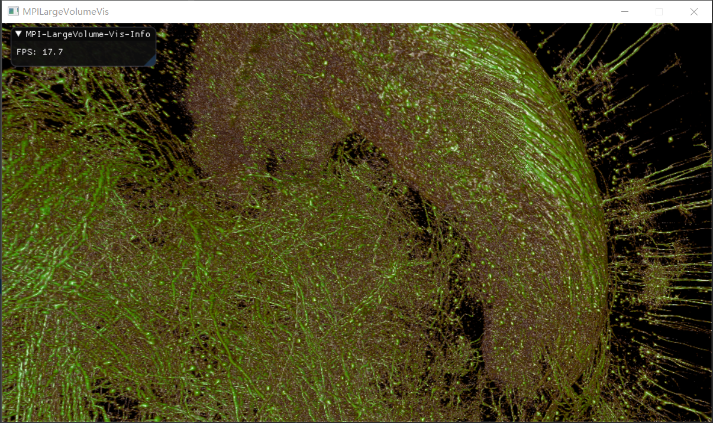
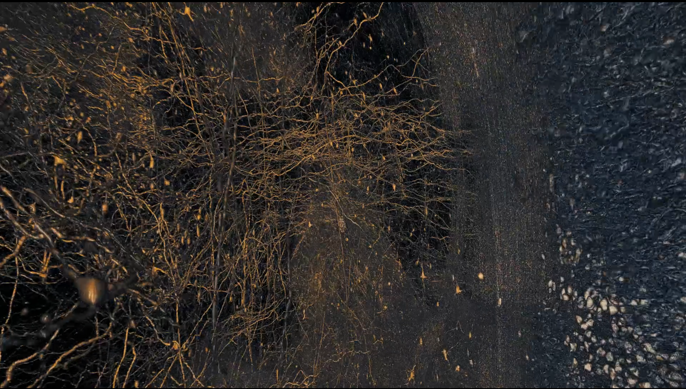

# VolumeSlicer

### Large-scale Volume Data Visualization

## Item

1.**Big-Screen Parallel Visualization:** 
Based on real-time volume renderer, using MPI to pass messages.

2.**High-Quality Renderer and Path Editor:** 
Using path-editor to generator camera path then render with an off-screen volume renderer.

3.**Slice Visualization Extract from Large-Scale Volume:** 
For any position and angle slice, and provide access with web.

## Feature
 1.**Three backends for volume renderer implement:**
 Provide OpenGL and CUDA real-time volume renderer, CUDA and CPU off-screen volume renderer.
 
 2.**Easy to Integrated:** 
 Volume renderer provide an interface like follows
 ```c++
class IVolumeRenderer{
public:
    IVolumeRenderer() = default;

    virtual ~IVolumeRenderer(){}

    virtual auto GetBackendName()-> std::string = 0;

    virtual void SetMPIRender(MPIRenderParameter) = 0;

    virtual void SetStep(double step,int steps) = 0;

    virtual void SetCamera(Camera camera) = 0;

    virtual void SetTransferFunc(TransferFunc tf) = 0;

    virtual void render(bool sync) = 0;

    virtual auto GetImage()->const Image<Color4b>& = 0;

    virtual void resize(int w,int h) = 0;

    virtual void clear() = 0;
};

class ICompVolumeRenderer: public IVolumeRenderer{
public:
    virtual void SetVolume(std::shared_ptr<CompVolume> comp_volume) = 0;

    virtual void SetRenderPolicy(CompRenderPolicy) = 0;

};

class CUDACompVolumeRenderer: public ICompVolumeRenderer{
public:
    static std::unique_ptr<CUDACompVolumeRenderer> Create(int w,int h,CUcontext ctx=nullptr);
};

class OpenGLCompVolumeRenderer: public ICompVolumeRenderer{
public:
    static std::unique_ptr<OpenGLCompVolumeRenderer> Create(int w,int h,bool create_opengl_context = true);
};
``` 
Renderer return a image data in cpu memory, but if you choose to use OpenGL renderer while you have create a OpenGL context outside,
you can choose to pass ```create_opengl_context=false``` when creating ```OpenGLCompVolumeRenderer```, then
the renderer internal with use your outside OpenGL context which meanings you don't need to get image by call ```GetImage``` but
just call ```render``` in you render loop.

3.**Flexible Volume Data Format:**
For better perfermance, you can define your own data format without recompiling the renderer. 
Just extents the data reader by the plugin ```IBlockVolumeProviderPluginInterface``` in
```VolumeSlicer/Ext/iblock_volume_plugin_interface.hpp```

## ScreenShot
* Real-Time LargeVolume Visualization


* Off-Screen LargeVolume Visualization
