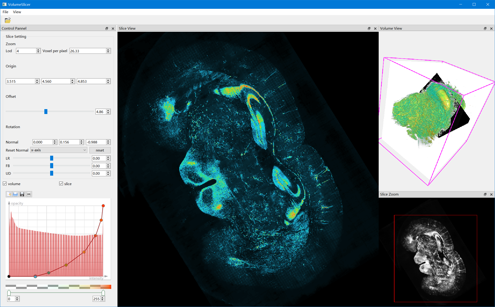
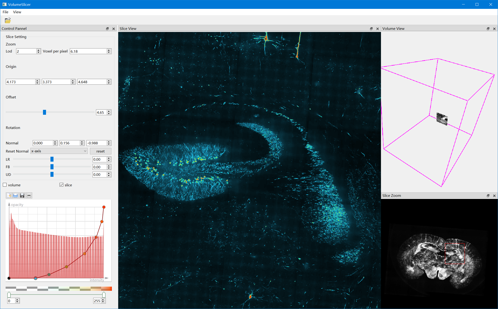

# QTVolumeSlicer
桌面版的切片浏览器(不再更新)




## 交互方式
鼠标拖动切片
滚轮缩放切片沿着法向量前后运动
按住ctrl后缩放滚轮 对切片进行缩放
左击图片进行更新
QE键用于切片的自己平面内旋转 即绕着normal轴
AD键绕着x轴 WS绕着y轴

## 运行配置文件
```json
{
  "comp_volume": {
    "comp_config_file_path": "E:/MouseNeuronData/mouse_file_config.json",
    "comp_volume_space": [0.00032,0.00032,0.001]
  },
  "raw_volume": {
    "raw_volume_path": "E:/MouseNeuronData/mouselod6_366_463_161_uint8.raw",
    "raw_volume_dim": [366,463,161],
    "raw_volume_space": [0.01,0.01,0.03]
  }
}
```